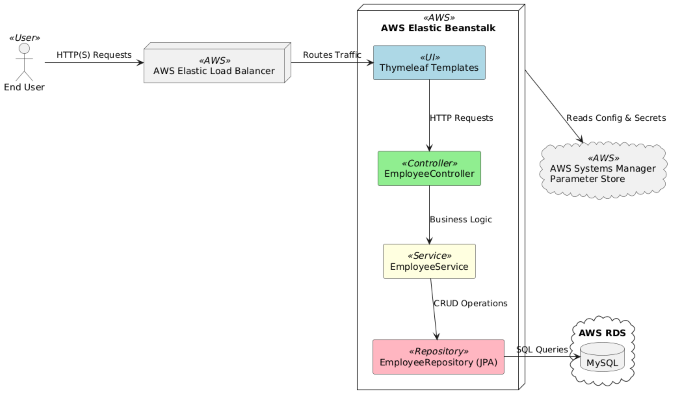
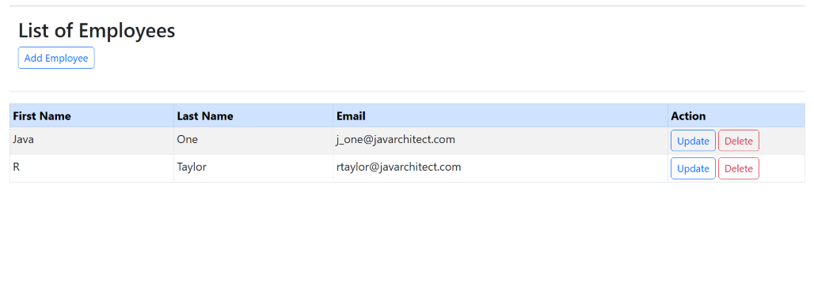
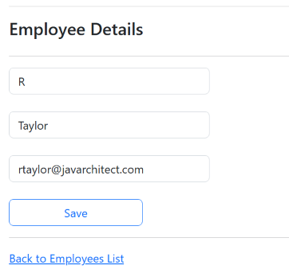

# Employee CRUD Management System

A full-stack **Spring Boot 3** application for managing employee records, featuring secure AWS Parameter Store integration, a responsive **Thymeleaf** UI, and **Spring Data JPA** for database interactions. Designed with **cloud deployment readiness** in mind.

---

## 🚀 Features

* **Create, Read, Update, Delete (CRUD)** operations for employees
* **MySQL** as the persistent data store
* **Thymeleaf** templating engine for dynamic server-side rendering
* **Spring Data JPA** for streamlined database access
* **AWS Parameter Store** for encrypted configuration management
* **Cloud-ready** for deployment on AWS Elastic Beanstalk
* **Maven** for build and dependency management

---

## 🛠 Tech Stack

* **Backend:** Spring Boot 3, Spring Data JPA
* **Frontend:** Thymeleaf, HTML, CSS
* **Database:** MySQL
* **Cloud:** AWS Parameter Store, AWS Elastic Beanstalk
* **Build Tool:** Maven
* **Language:** Java 17

---

## 🏗️ Architecture Diagram



---

## 📷 Screenshots




---

## ⚙️ Getting Started

### Prerequisites

* Java 17+
* Maven
* MySQL running locally or remotely on RDS
* AWS account (for Parameter Store integration)

### Installation & Run

```bash
# Clone the repository
git clone https://github.com/yourusername/employee-crud-demo.git
cd employee-crud-demo

# Configure MySQL & AWS credentials in application.properties or Parameter Store
spring.datasource.url=jdbc:mysql://localhost:3306/employee_db
spring.datasource.username=YOUR_DB_USER
spring.datasource.password=YOUR_DB_PASSWORD

# Build & run
mvn spring-boot:run
```

---

## 📦 Deployment on AWS Elastic Beanstalk

1. Package the app:

   ```bash
   mvn clean package
   ```
2. Deploy the `.jar` or `.war` to AWS Elastic Beanstalk via AWS Console or CLI.
3. Ensure AWS Parameter Store is configured with database credentials.

---

## 👨‍💻 Author

**Rodney Taylor** – Java Developer and Software/Solution Architect passionate about backend engineering and cloud solutions.
[LinkedIn](https://www.linkedin.com/in/rodney-taylor-uk) | [Portfolio](https://www.javarchitect.com) | [GitHub](https://github.com/rtaylor02)

---

## 📄 License

This project is licensed under the MIT License.

---
